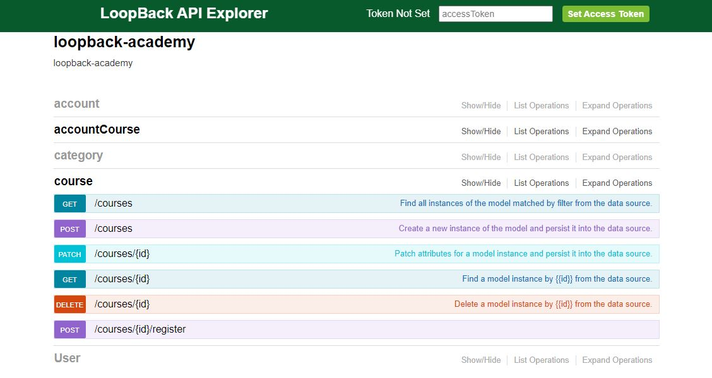

# My Application

The project is generated by [LoopBack](http://loopback.io).

# screenshot


# references:
https://loopback.io/doc/en/lb3/Create-a-simple-API.html#create-models

https://loopback.io/doc/en/lb3/Getting-started-part-II.html

https://loopback.io/doc/en/lb3/Define-a-remote-hook.html

https://loopback.io/doc/en/lb3/Validating-model-data.html

https://loopback.io/doc/en/lb3/Querying-related-models.html

https://loopback.io/doc/en/lb3/Exposing-models-over-REST.html

https://stackoverflow.com/questions/28523782/how-can-i-use-body-parser-with-loopback

https://loopback.io/doc/en/lb3/Remote-methods.html

https://loopback.io/doc/en/lb3/MongoDB-connector.html#handling-objectid

https://stackoverflow.com/questions/31773068/what-does-through-model-mean-in-loopback

https://loopback.io/doc/en/lb3/Include-filter.html


1. install cli
```
npm install -g loopback-cli
```


2. init app
```
lb
app name: loopback-academy
directory: loopback-academy
v3
empty-server
```

-> run: 
```
npm start
```
localhost:3000/explorer


3. create datasource
```
lb datasource
name: mongodbDs
connector: MongoDB (supported by StrongLoop)
connection url: <>
others like name, database,... can be skipped
install mongoloopback-connector-mongodb@^4.0.0 Yes
```


-> view file server/datasources.json

4. create models: category, course, account, accountCourse
```
lb model
model name: category
attach category to: mongodbDs (mongodb)
base class PersistedModel
Expose category via the REST API? Yes
Custom plural form: 
Common model or server only? common
Let's add some category properties now.
Enter an empty property name when done.
? Enter the property name: name
? Property type: string
? Required? Yes
? Default value[leave blank for none]:
Let's add another category property.
Enter an empty property name when done.
? Enter the property name:
```

```
lb model
? Enter the model name: course
? Select the datasource to attach course to: mongodbDs (mongodb)
? Select model's base class PersistedModel
? Expose course via the REST API? Yes
? Custom plural form (used to build REST URL):
? Common model or server only? common
Let's add some course properties now.

Enter an empty property name when done.
? Enter the property name: name
? Property type: string
? Required? Yes
? Default value[leave blank for none]:

Let's add another course property.
Enter an empty property name when done.
? Enter the property name: description
? Property type: string
? Required? Yes
? Default value[leave blank for none]:

Let's add another course property.
Enter an empty property name when done.
? Enter the property name: categoryId
? Property type: string
? Required? Yes
? Default value[leave blank for none]:

Let's add another course property.
Enter an empty property name when done.
? Enter the property name:
```


```

? Enter the model name: account
? Select the datasource to attach account to: mongodbDs (mongodb)
? Select model's base class PersistedModel
? Expose account via the REST API? Yes
? Custom plural form (used to build REST URL):
? Common model or server only? common
Let's add some account properties now.

Enter an empty property name when done.
? Enter the property name: email
? Property type: string
? Required? Yes
? Default value[leave blank for none]:

Let's add another account property.
Enter an empty property name when done.
? Enter the property name: password
? Property type: string
? Required? Yes
? Default value[leave blank for none]:

Let's add another account property.
Enter an empty property name when done.
? Enter the property name:
```

```

? Enter the model name: accountCourse
? Select the datasource to attach accountCourse to: mongodbDs (mongodb)
? Select model's base class PersistedModel
? Expose accountCourse via the REST API? Yes
? Custom plural form (used to build REST URL):
? Common model or server only? common
Let's add some accountCourse properties now.

Enter an empty property name when done.
? Enter the property name: accountId
? Property type: string
? Required? Yes
? Default value[leave blank for none]:

Let's add another accountCourse property.
Enter an empty property name when done.
? Enter the property name: courseId
? Property type: string
? Required? Yes
? Default value[leave blank for none]:

Let's add another accountCourse property.
Enter an empty property name when done.
? Enter the property name:
```


--> run

7. limit api, limit account: only read


config.json:
```
"remoting": {
...
"sharedMethods": {
"*": false,
"find": true,
"findById": true,
"create": true,
"prototype.patchAttributes": true,
"deleteById": true,
"register": true
}
}
```


account.js:
```
module.exports = function(Account) {
Account.disableRemoteMethodByName('create');
Account.disableRemoteMethodByName('prototype.patchAttributes');
Account.disableRemoteMethodByName('deleteById');
};
```

8. validate data
course.js:
```
Course.validatesLengthOf('name', { min: 5, max: 20 });
```

account.js:
```
Account.validatesUniquenessOf('email', { message: 'email is not unique' });
```

package.json:
```
"dependencies": {
...
"loopback-connector-mongodb": "^5.2.1",
...
}
```
```
npm install
```


course.json:
```
"categoryId": {
"type": "string",
"required": true,
"mongodb": {
"dataType": "ObjectId"
}
}
```


account-course.json:
```
"accountId": {
"type": "string",
"required": true,
"mongodb": {
"dataType": "ObjectId"
}
},
"courseId": {
"type": "string",
"required": true,
"mongodb": {
"dataType": "ObjectId"
}
}
```


--> run test


9. relation

```
lb relation
? Select the model to create the relationship from: course
? Relation type: belongs to
? Choose a model to create a relationship with: category
? Enter the property name for the relation: (category) loopback-datasource-juggler deprecated Scope method "getAsync()" is deprecated, use "find()" instead. ..\..\..\..\..\AppData\Roaming\npm\node_modules\loopback-cli\node_modules\generator-loopback\lib\helpers.js:132:37
? Enter the property name for the relation: category
? Optionally enter a custom foreign key:
? Allow the relation to be nested in REST APIs: No
? Disable the relation from being included: No
```

```
lb relation
? Select the model to create the relationship from: account
? Relation type: has many
? Choose a model to create a relationship with: course
? Enter the property name for the relation: (courses) loopback-datasource-juggler deprecated Scope method "getAsync()" is deprecated, use "find()" instead. ..\..\..\..\..\AppData\Roaming\npm\node_modules\loopback-cli\node_modules\generator-loopback\lib\helpers.js:132:37
? Enter the property name for the relation: courses
? Optionally enter a custom foreign key:
? Require a through model? Yes
? Choose a through model: accountCourse
? Allow the relation to be nested in REST APIs: No
? Disable the relation from being included: No
```


-> locahost:3000/explorer
get account
filter: {"include": "courses"}
filter: {"include": { "relation": "courses", "scope": { "include": "category" } }}


10. authentication, register course

add server/routes/auth.js, server/routes/utils.js

```
npm i bcryptjs jsonwebtoken randomstring
```


server/server.js:
```
boot(app, __dirname, function(err) {
  if (err) throw err;

  // routes
  app.use('/auth', require('./routes/auth.js'));

  // start the server if `$ node server.js`
  if (require.main === module)
    app.start();
});
```

middleware.json:
```
"parse": {
    "body-parser#json": {},
    "body-parser#urlencoded": {
      "params": {
        "extended": true
      }
    }
  }
```

course.js:
```
const utils = require('../../server/routes/utils.js')
const models = require('../../server/server.js').models

....

	// additional methods
	Course.register = async function(id, reqBody, callback) {

		console.log('course.js: register, id: ' + id)
		console.log(reqBody)

		let data = { 'courseId': id, 'accountId': reqBody.accountId }
		await models.accountCourse.create(data);
		return "register ok"
	}

	// declare
	Course.remoteMethod(
		'register', {
			http: { path: '/:id/register', verb: 'post' },
			accepts: [
			{ arg: 'id', type: 'string', required: true, http: { source: 'path' } },
			{ arg: 'reqBody', type: 'object', http: { source: 'body' }}
			],
			returns: { arg: 'result', type: 'string' }
		}
		);


	// middleware
	Course.beforeRemote('register', async function(context, affectedInstance, next) {

		// check access token
		try {
			const token = context.req.get('x-access-token')
			const decoded = await utils.verifyJWT(token, "abcdef")
			return context.req.body.accountId = decoded.userId;

		} catch (err) {
			console.log(err)
			return context.res.status(401).json({ error: err.message })
		}

	});

```
--> run test

